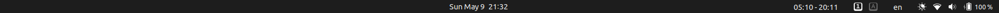
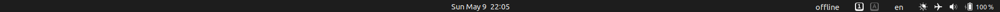

# Sunrise & Sunset

This extension is created specially for [Argos GNOME Shell extension](https://github.com/p-e-w/argos). It shows in top bar sunrise and sunset for current date. When extension is connected to the internet, it downloads all data for the rest of the month and saves it into `data.plk`. If there is no internet connection and no downloaded data available, it shows in top bar *offline and no data available*.



downloaded data available



no internet connection and no downloaded data available

## Setting up `config.py`


```python
LATITUDE = "LATITUDE"
LONGITUDE = "LONGITUDE"
DATA_PATH = "/FULL/PATH/TO/data.plk"
```

## Setting up `sunrise-sunset.1s.sh`

```bash
#!/bin/bash

data=$(python3 /FULL/PATH/TO/main.py)
echo $data
```

* make `sunrise-sunset.1s.sh` executable
* move to `.config.argos/`
* enjoy